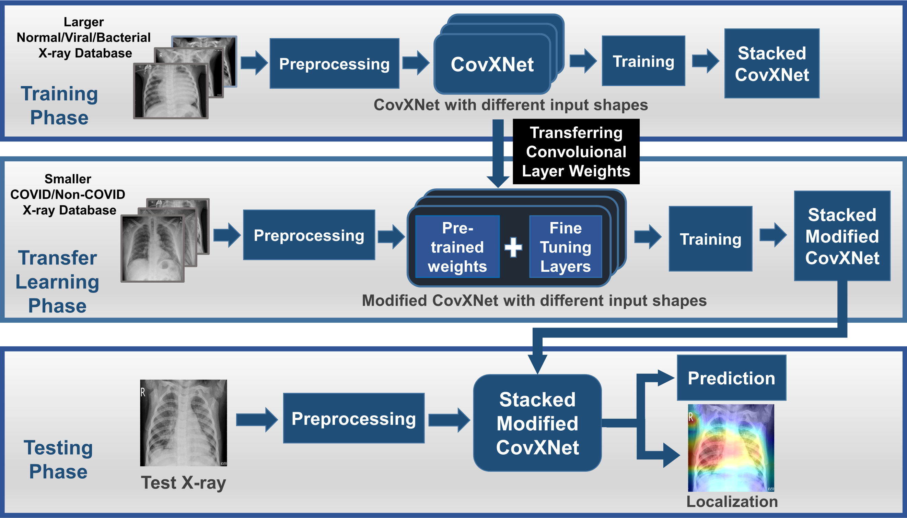
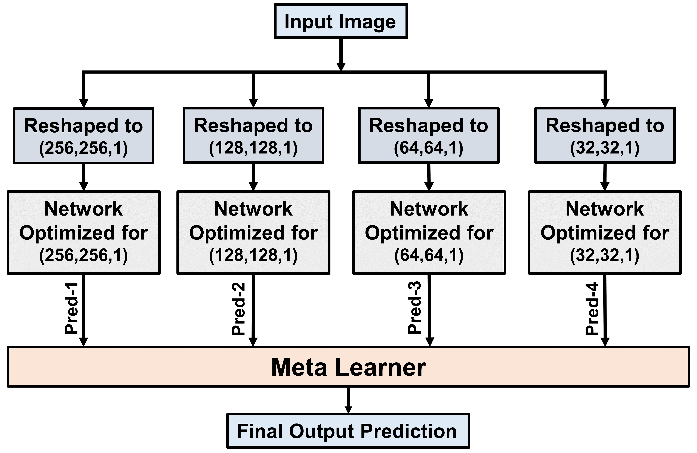
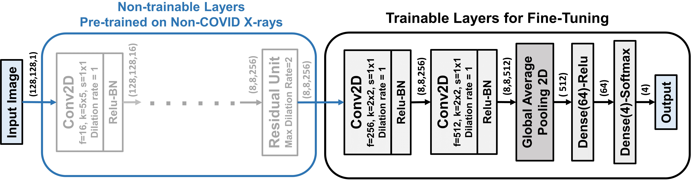

# [CovXNet: A Multi-Dilation Convolutional Neural Network for Automatic COVID-19 and Other Pneumonia Detection from Chest X-ray Images with Transferable Multi-Receptive Feature Optimization](https://www.sciencedirect.com/science/article/pii/S0010482520302250)

**Abstract:**

With the recent outbreak of COVID-19, fast diagnostic testing has become one of the major challenges due to the critical shortage of test kit. Pneumonia, a major effect of COVID-19, needs to be urgently diagnosed along with its underlying reasons. In this paper, deep learning aided automated COVID-19 and other pneumonia detection scheme is proposed utilizing a small amount of COVID-19 chest X-rays. A deep convolutional neural network (CNN) based architecture, named as CovXNet, is proposed that utilizes depthwise convolution with varying dilation rates for efficiently extracting diversified features from chest X-rays. Since the chest X-ray images corresponding to COVID-19 caused pneumonia and other traditional pneumonia have significant similarities, at first, a large number of chest X-rays corresponding to normal and (viral/bacterial) pneumonia patients are used to train the proposed CovXNet. Learning of this initial training phase is transferred with some additional fine-tuning layers that are further trained with a smaller number of chest X-rays corresponding to COVID-19 and other pneumonia patients. In the proposed method, different forms of CovXNets are designed and trained with X-ray images of various resolutions and for further optimization of their predictions, a stacking algorithm is employed. Finally, a gradient-based discriminative localization is integrated to distinguish the abnormal regions of X-ray images referring to different types of pneumonia. Extensive experimentations on two different datasets provide very satisfactory detection performance and thus the new scheme can serve as an efficient tool in the current state of COVID-19 pandemic.

**Paper link:** [here](https://www.sciencedirect.com/science/article/pii/S0010482520302250)

## Installation

Stable:
```bash
pip install covxnet
```

or

Latest:
```bash
pip install git+https://github.com/awsaf49/covxnet
```

## Usage

```python
from covxnet import CovXNet128
model = CovXNet128(input_shape=(128, 128, 3), num_classes=3)
```

## Example

**Notebook:** [Pneumonia Detection with CovXNet](https://www.kaggle.com/awsaf49/pneumonia-detection-with-covxnet)


## Method
**Visual Abstract:**



**Ensemble Network:**



**Architecture:**


